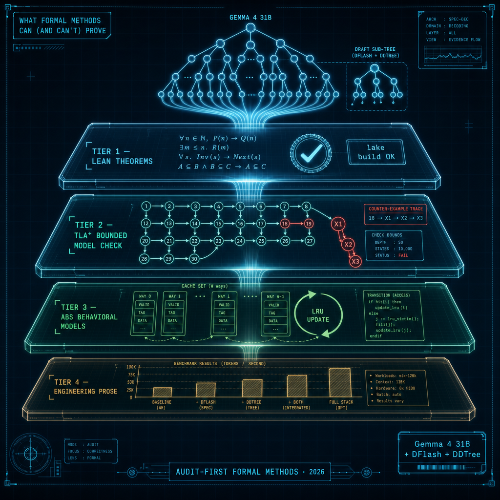

# g4-flashtree-formal-verification — formal-methods proof code for the G4-FlashTree blueprint



**Companion blog post:** [What formal methods can (and can't) prove about a Gemma 4 + DFlash + DDTree blueprint](https://amund.blog/g4-flashtree-formal-verification/)

## Summary

This is the **proof code** behind the blog post — Lean 4 theorems, TLA⁺
specs, and ABS behavioral models for a hypothetical *G4-FlashTree* stack
(Gemma 4 31B target + DFlash block drafter + DDTree tree verifier on Apple
Silicon).

The post and this directory exist because we tried to formalize the stack,
**audited the formalization before publishing**, and found that several of
the original artifacts were either non-compiling, unparseable, or
mathematically vacuous. After remediation, what survives is partitioned
into a four-tier evidence pyramid:

| tier | what it is | what survived |
|---|---|---|
| **Tier 1** | Lean 4 theorems, mechanically rechecked via `lake build` | 4 theorems over `ℝ`, zero `sorry`/`admit`, Mathlib pinned |
| **Tier 2** | TLA⁺ properties, bounded model-check via TLC2 v2.19 | 4 properties confirmed under bounded runs, **plus a load-bearing safe-vs-unsafe counter-example pair** |
| **Tier 3** | ABS behavioral models, illustrative — not verified | 3 demoted demos with `assert`s, no `absc` run captured |
| **Tier 4** | Engineering prose (zero-copy, ANE residency, perf) | not in the formal bundle |

The "(and can't)" half of the post is the most interesting half. See
[`reports/audit_lean.md`](./reports/audit_lean.md) and
[`reports/audit_tla_abs.md`](./reports/audit_tla_abs.md) for the original
audits, and [`reports/REMEDIATION_PLAN.md`](./reports/REMEDIATION_PLAN.md)
for the four-tier strategy that produced the surviving artifacts.

## What's in this directory

| path | purpose |
|---|---|
| [`lean/`](./lean/) | Lean 4 + Mathlib project. `lakefile.toml`, `lean-toolchain` (pinned to `leanprover/lean4:v4.30.0-rc2`), and four theorem files under `lean/G4FlashTreeTheory/`. Runs to a green build (see [`reports/lake_build.log`](./reports/lake_build.log)). |
| [`lean/G4FlashTreeTheory/RopeId.lean`](./lean/G4FlashTreeTheory/RopeId.lean) | Pythagorean-rotation preserves the dot product over a commutative ring. (Tier 1) |
| [`lean/G4FlashTreeTheory/TQTopo.lean`](./lean/G4FlashTreeTheory/TQTopo.lean) | Lipschitz-quantizer inner-product distortion bound `|⟨x,y⟩−⟨T(x),T(y)⟩| ≤ 2η‖x‖‖y‖+η²‖x‖‖y‖` over `InnerProductSpace ℝ V`. (Tier 1) |
| [`lean/G4FlashTreeTheory/AttnIso.lean`](./lean/G4FlashTreeTheory/AttnIso.lean) | Sliding-window softmax-attention is zero-leakage — the **denominator** (normalizer) is included; the audit caught the original modelling attention as `Nat`-summation. (Tier 1) |
| [`lean/G4FlashTreeTheory/MaskEquiv.lean`](./lean/G4FlashTreeTheory/MaskEquiv.lean) | `tree_eq_path_softmax_total`: tree-mask softmax-attention output equals path-attention output, with the denominator computed only over ancestors. The **headline Tier-1 result** — closes the audit's biggest overstatement. |
| [`tlaplus/`](./tlaplus/) | Three TLA⁺ specs + their model-check configs. Use TLC2 v2.19 + Java 21. |
| [`tlaplus/rollback.tla`](./tlaplus/rollback.tla) | Rollback safety. Two configs: [`rollback.cfg`](./tlaplus/rollback.cfg) (safe — 31 states, `NoGhostReads` holds) and [`rollback_unsafe.cfg`](./tlaplus/rollback_unsafe.cfg) (guard removed — 4-state counter-example). **Featured artifact.** (Tier 2) |
| [`tlaplus/dispatch.tla`](./tlaplus/dispatch.tla) | AMX/ANE dispatch safety. 4 states. `DataIntegrity` and `NoCollision` hold; original `DeadlockFree` was removed because it was false in `Init`. (Tier 2) |
| [`tlaplus/non_interfere.tla`](./tlaplus/non_interfere.tla) | Speculative-decoding prefix-correctness against a fixed target trace. 252 states at Tokens={t1,t2}, MaxTraceLen=3, MaxDraftLen=2. Audit caught the original `.cfg` couldn't have produced a green run (TLC errored on `Seq(Tokens)`); rewrote with a `BoundedSeq` helper. `Termination` was dropped — initial-state stuttering. (Tier 2) |
| [`tlc_runs/`](./tlc_runs/) | Captured TLC stdout/stderr per spec, including parse-fail evidence (`*.parse-fail.log`) from the audit's reproduction of the originally-shipped (broken) files. The two log files **`rollback.log`** (no counter-example) + **`rollback_unsafe.log`** (4-state trace) together are the strongest single piece of evidence — they show the safety guard is *load-bearing*, not decorative. |
| [`abs/`](./abs/) | Three ABS behavioral models. All headers explicitly say "Behavioral model — illustrates …; does not verify …". The `absc` toolchain is **not installed in our environment**; the assertions hold by inspection only (Tier 3). |
| [`abs/slc_tiling.abs`](./abs/slc_tiling.abs) | LRU eviction over a 16 MB pinned LUT + 10×8 MB tile budget = 96 MB ceiling. The audit caught the original loaded `16 + 12×8 = 112 MB` into a 96 MB cache (would print `WARNING: DRAM Spill`); this version stays at the ceiling with `assert occupancy ≤ maxCapacity` after every access. |
| [`abs/eml_ops.abs`](./abs/eml_ops.abs) | Softmax↔Min-Plus parity demonstration on one numeric pair (`p=0.4, q=0.6`). Cycle constants 24/1 are explicit placeholders, not measured. |
| [`abs/tree_perf.abs`](./abs/tree_perf.abs) | DDTree budget sweep — analytic curve `MAL(B)/lat(B)` evaluated at `B ∈ {1, 2, 4, 8, 16, 32, 64}`. `assert optimalB == 8` against a hand-computed argmax. Not derived from real measurements. |
| [`reports/`](./reports/) | The audit + remediation paper trail: original audits, REMEDIATION_PLAN.md (four-tier strategy), per-track remediation notes (Lean, TLA+, ABS), Track R cross-document consistency notes, full `lake build` log. |

## How to run

### Lean — `lake build` (primary verification)

```bash
# elan must be on PATH
export PATH="$HOME/.elan/bin:$PATH"

cd lean
lake update    # pulls Mathlib v4.30.0-rc2
lake build     # ~5 min on first run (Mathlib compile)
```

A successful build of every theorem produces `EXIT: 0`. The committed
[`reports/lake_build.log`](./reports/lake_build.log) is the green run from
the remediation pass.

### TLA⁺ — TLC bounded model checks

Tools used in the audit and remediation:

```bash
# tla2tools.jar — get from https://github.com/tlaplus/tlaplus/releases
# Java 21 — system java on macOS may not work; Homebrew openjdk@21 does

JAR=/Users/amund/.tla/tla2tools.jar
JAVA=/opt/homebrew/opt/openjdk@21/bin/java

cd tlaplus

# Safe rollback — should pass
$JAVA -cp "$JAR" tlc2.TLC -config rollback.cfg rollback.tla
# Unsafe rollback — should produce a 4-state counter-example
$JAVA -cp "$JAR" tlc2.TLC -config rollback_unsafe.cfg rollback.tla

# Other two specs
$JAVA -cp "$JAR" tlc2.TLC -config dispatch.cfg dispatch.tla
$JAVA -cp "$JAR" tlc2.TLC -config non_interfere.cfg non_interfere.tla
```

Reference output for every run is in [`tlc_runs/`](./tlc_runs/).

### ABS — not run in this work

The `absc` compiler was not installable in our environment (no Homebrew
formula; Docker image hung in our session). The three `.abs` files are
**inspection-only** behavioral models. To run them yourself, install the
ABS toolchain from <https://github.com/abstools/abstools> and execute via
the Erlang or Maude backend.

## Caveats (the "and can't" half)

1. **Lean theorems are over `ℝ` (or a commutative ring)**, not IEEE-754.
   Real Gemma 4 runs in bf16/fp16, which is not a commutative ring (no
   associativity, denormals, saturating `exp`). The proofs do **not**
   transfer to floating-point hardware without a separate float analysis.
2. **The Lean theorems prove things about *interfaces*, not Gemma kernels.**
   `TQTopo` is a generic Lipschitz-perturbation bound — we did not formalize
   TurboQuant's Hadamard rotation. `AttnIso` treats scores as abstract
   real-valued sequences — we did not formalize Q/K projection.
3. **TLA⁺ state spaces are tiny** (4 / 31 / 252 reachable states). They are
   *protocol skeletons*, not system models. Cache coherence, IOSurface
   lifetime, GPU↔ANE memory ordering, sampling, KV-cache state — all
   abstracted away. **Bounded model checking is not a proof for unbounded N.**
4. **`non_interfere.tla` proves prefix-correctness against a fixed target
   trace, not non-interference of drafter on a target *distribution*.**
   There is no probability, no sampling, no temperature in the model. A real
   probabilistic non-interference theorem belongs in Lean with
   `MeasureTheory`; we didn't get there.
5. **ABS files are demonstrations, not verifications.** No `absc` run was
   captured. The cycle constants in `eml_ops.abs` (24 vs 1) are placeholders;
   the LRU policy in `slc_tiling.abs` is a fiction relative to M3 Ultra's
   hardware-managed SLC. The right artifact for SLC residency is a real
   `powermetrics`/Instruments trace under prefill — not in this directory.
6. **No Lean theorem is wired to a wall-clock or `powermetrics` measurement.**
   This directory makes no performance claims. See the sibling post
   [Finding the Performance Floor for Gemma 4 31B?](https://amund.blog/finding-gemma4-performance-floor/)
   for measured-throughput work on the same hardware.
7. **Two original artifacts were deleted as vacuous** —
   `zerocopy.lean` (record-projection tautology) and `subsumption.lean`
   (modus ponens dressed in LLM vocabulary). The "zero-copy IOSurface" and
   "zero-hallucination" claims are no longer in the formal bundle; they
   belong to engineering prose and runtime measurement. The audits in
   [`reports/audit_lean.md`](./reports/audit_lean.md) document why.

## License

Apache-2.0 — see the top-level [`../LICENSE`](../LICENSE).
