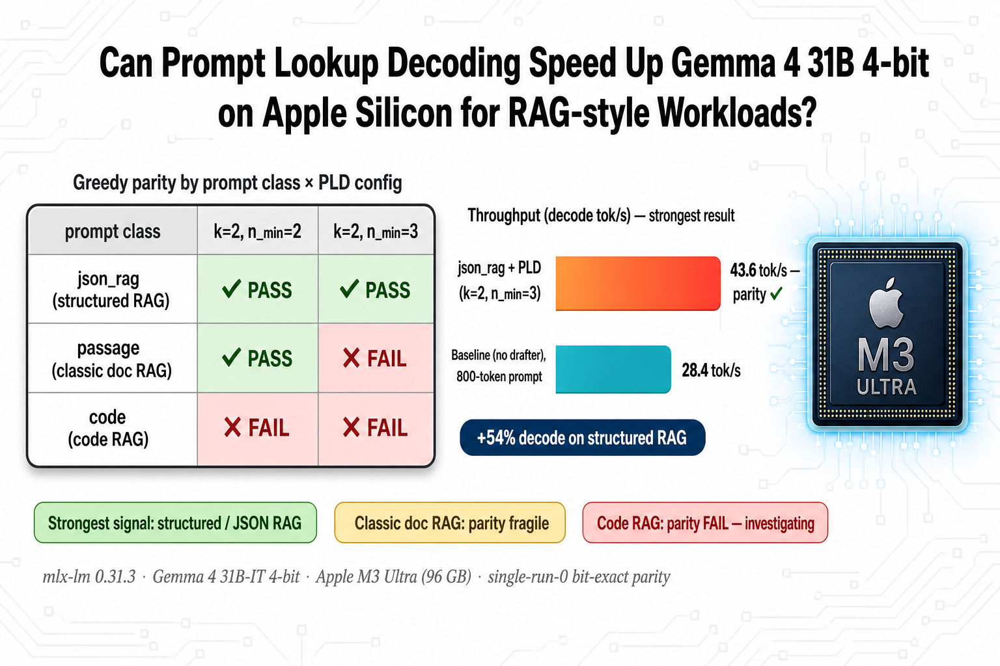

# pld-gemma4-mlx — Prompt Lookup Decoding for Gemma 4 31B 4-bit on Apple Silicon



**Companion blog post:** [Can Prompt Lookup Decoding Speed Up Gemma 4 31B 4-bit on Apple Silicon for RAG-style Workloads?](https://amund.blog/accelerating-gemma4-31b-pld-mlx-lm/)

## Summary

This is an **early investigation, not a victory lap.** The headline finding from a controlled rerun (3-class bench, 800-token prompts, 1 warmup + 3 measured passes per config) is:

- **json_rag** (structured / JSON RAG) is the only prompt class where greedy parity holds at *both* tested PLD configurations (`k=2, n_min=2` and `k=2, n_min=3`). PLD lift on this class: **28.4 → 43.6 tok/s decode (+54 %)**. This is the most credible signal in the rerun.
- **passage** (classic doc RAG) holds parity at `k=2, n_min=2` (28.6 → 45.5 tok/s, +59 %) but **fails parity at `k=2, n_min=3`** on the same prompt. A correct PLD implementation should hold parity for every `n_min` — verifier always has the final say. The split is direct evidence of a content-dependent rollback issue.
- **code** (code RAG) fails parity at every tested PLD config. The PLD trajectory diverges into different code, including a self-aware "This is a bug" comment that the no-drafter baseline never emits.

All parity checks are **single-run bit-exact diffs of run 0 versus the no-drafter baseline run 0** — not a 3-run × 3-run cross product. Treat the PASSes accordingly: provisional, not certified.

The technique itself is well-validated externally (Saxena 2023; integrations in HuggingFace Transformers, vLLM, llama.cpp, mlx-lm, TensorRT-LLM). What this rerun shows is that the *interaction* of PLD with this particular Gemma 4 31B 4-bit + `mlx-lm 0.31.3` + custom rollback harness has bugs we don't fully understand yet.

## What's in this directory

| file | purpose |
|---|---|
| [`pld_drafter.py`](./pld_drafter.py) | The n-gram suffix-match drafter. Pure Python, zero MLX/torch deps. Scans the running token history right-to-left for the most recent occurrence of the current `n`-token suffix and emits the next `k` tokens that followed that match. |
| [`pld_spec_decode.py`](./pld_spec_decode.py) | The verify-and-rollback spec-decode loop. Re-implements `mlx-lm`'s spec-decode shape using its own KV-cache primitives (`make_prompt_cache`, `trim_prompt_cache`) so a pure-Python drafter can plug in. Greedy bit-identical to `mlx_lm.generate(...)` under correct rollback — see the post for cases where that breaks. |
| [`prompts.py`](./prompts.py) | The three prompt classes used in the bench: `passage` (long-context summarization), `code` (a partially-implemented Vector2D module), `json_rag` (structured employee records + add-a-record request). |
| [`bench_pld_3class_rerun.py`](./bench_pld_3class_rerun.py) | The exact bench script behind the post's numbers. Truncates/pads all classes to 800 tokens, runs k=0 baseline + PLD `k=2` at `n_min ∈ {2, 3}`, reports prefill/decode/total tok/s + TTFS + accept rate per [CLAUDE.md §9.1](https://github.com/atveit/research) conventions, and bit-exact-diffs run-0 vs the baseline for parity. |
| [`hero.png`](./hero.png) | Hero image from the blog post. |

## How to run

```bash
# Apple Silicon Mac, Python 3.12+, ~17 GB free for the model checkpoint.
pip install mlx-lm==0.31.3
cd pld-gemma4-mlx
python bench_pld_3class_rerun.py
```

The first run downloads `mlx-community/gemma-4-31b-it-4bit` (~17 GB) into the
HuggingFace cache. Subsequent runs use the local cache.

## Caveats

1. **Parity check is a run-0 only diff.** A stricter test would diff every measured run against every baseline run (3×3 = 9 comparisons per config) and confirm cross-prompt-length stability. The PASSes in the post are provisional, not certified.
2. **All measurements on a single (model, harness, prompt-set, hardware) triple**: `mlx-community/gemma-4-31b-it-4bit`, `mlx-lm 0.31.3`, M3 Ultra 96 GB. The published external 2–4× speedups apply to *other* triples.
3. **Greedy parity only.** At nonzero temperature, the verifier becomes a sampler and the bit-exactness claim doesn't apply.
4. **There is a rollback bug somewhere in this stack.** The same-prompt-different-`n_min` parity split on passage is direct evidence. We don't know yet whether it's in `pld_spec_decode.run`, in mlx-lm's KV-cache trim path, or in an async-eval ordering issue.
5. **SWA boundary.** Gemma 4 has `sliding_window=1024`; this stack refuses inputs where `prompt_tokens + max_tokens > 1023`.

## License

Apache-2.0 (see repo root).
